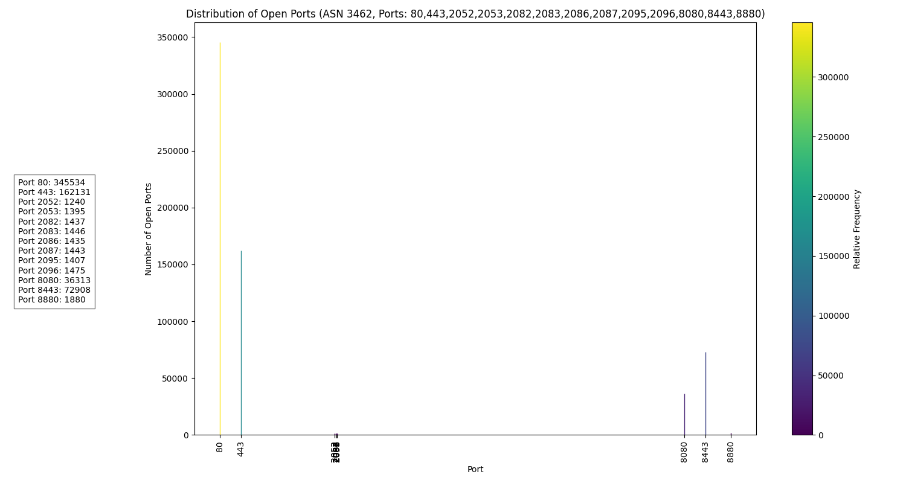

# open-ports-distributed
scan asn and detect the open port and make a statics with graph
## Open Ports Result    

## AS2497 Internet Initiative Japan Inc,3928576
### asn2497_80,443,2052,2053,2082,2083,2086,2087,2095,2096,8080,8443,8880.png

## AS9689 SK Broadband Co Ltd,291840
### asn9689_80,443,2052,2053,2082,2083,2086,2087,2095,2096,8080,8443,8880.png

## AS4713 NTT Communications Corporation Japan,28692736
### asn4713_80,443,2052,2053,2082,2083,2086,2087,2095,2096,8080,8443,8880.png

## AS31898 Oracle Corporation,3044608
### asn31898_80,443,2052,2053,2082,2083,2086,2087,2095,2096,8080,8443,8880.png

## AS906 DMIT Cloud Services,30208
### asn906_80,443,2052,2053,2082,2083,2086,2087,2095,2096,8080,8443,8880.png

## AS4609 Companhia de Telecomunicacoes de Macau SARL CTM-MO,265216
### asn4609_80,443,2052,2053,2082,2083,2086,2087,2095,2096,8080,8443,8880.png

## AS4760 HKT Limited,1831936
### asn4760_80,443,2052,2053,2082,2083,2086,2087,2095,2096,8080,8443,8880.png

## AS3462 Data Communication Business Group HINET,12237056
### asn3462_80,443,2052,2053,2082,2083,2086,2087,2095,2096,8080,8443,8880.png
